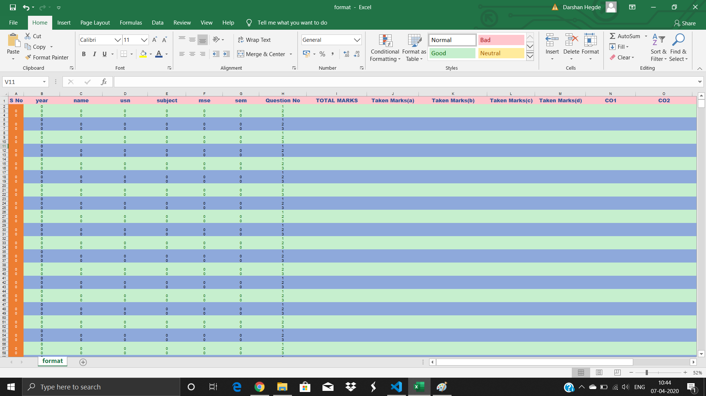
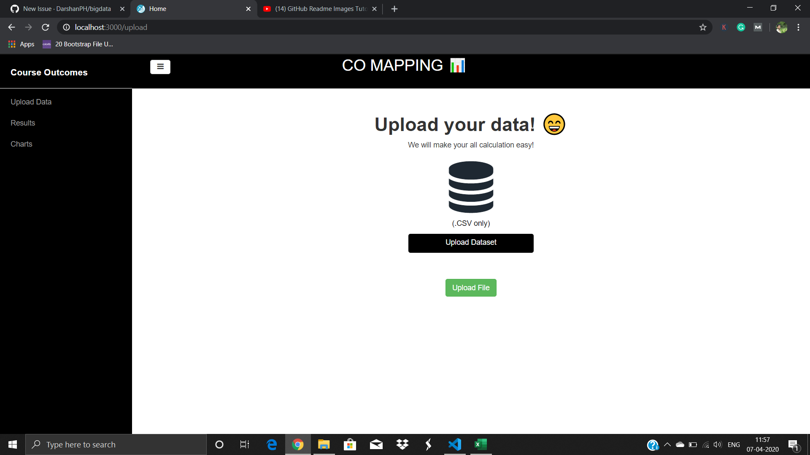
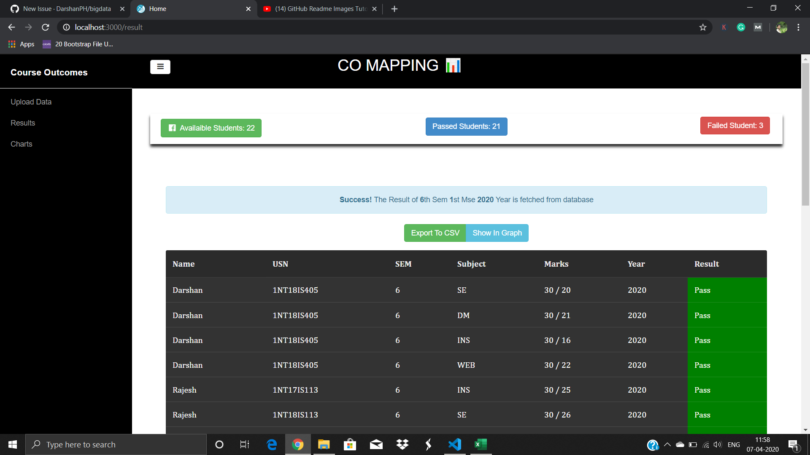
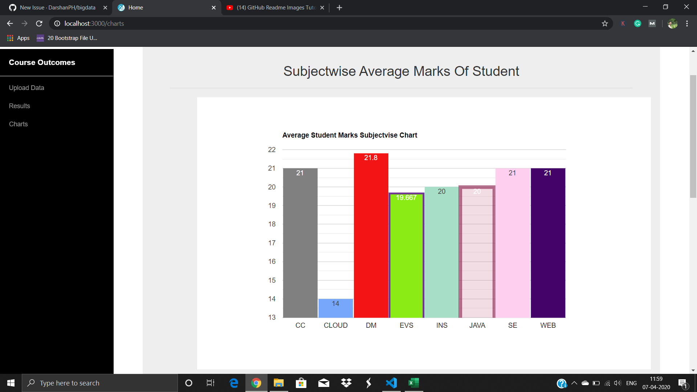

# CO(Course Outcome) MAPPING
Welcome to Co Mapping, We make all the mse calculations, very easy by implementing this project,

# Installation:
	 Download any One IDE such as  Visual Studio Code, or Atom editer
     Install MongoDb from official website
     install some python libraries
        pip install flask
        pip install pandas
        pip install csv
        pip install session
        pip install request
        pip install redirect
        pip install url_for
        pip install pymongo
        pip install render_template
      Run It By typing  "path/app.py"
      Now the server is started, it will run in the localhost port 3000
      

# Application:
	
<b>1. Easy To use:</b>
	CO Mapping Web application is very easy to use, everything is easy to find, Thanks to the UI developer. (me😜)
	
<b>2. Light Weight </b>
	We Use flask for backend and html and javascript for front end, It is light weight and easy to handle
	
<b>3. Google Charts used </b>
	All the charts we have used in this project is google charts, it is loaded fast compare to charts.js or any other chart platform

# Resources We Use:
    Back end: Flask, csv, pandas, pymongo for all MongoDb operation
        Flask: Flask is a lightweight WSGI web application framework. It is designed to make getting started quick and easy, with the ability to scale up to complex applications.
        csv: Python provides a CSV module to handle CSV files. To read/write data, you need to loop through rows of the CSV file.
        pandas: pandas is a fast, powerful, flexible and easy to use open source data analysis and manipulation tool.
        Pymongo: The pymongo package is a native Python driver for MongoDB.
    Front end: HTML, CSS, JavaScript, bootstrap, md bootstrap, semantic ui, Jinja 2
        bootstrap: The most popular HTML, CSS, and JS library
        md bootstrap:  MDBootstrap have hundreds of beautiful components, templates, animations, effects and helpers. Everything fully responsive, compatible with different browsers and it is easy to use.
        jinja 2: Jinja is a modern and designer-friendly templating language for Python
     Database: MongoDb
        
# What We Done:
One who using this web software need to upload the excel sheet by entering all the information, Then the software make all the <b> co </b> related calculation itself. detail explain is available on the the below section.

# Excel Format:

This is the Excel of we prepare, The one who using this software application must enter their data only in this excel sheet or excel format. This format is available in the software itself, you can directly download it by clicking download button.

After He/she type all the student information, He/She convert that into csv format. After that upload the csv data into the project by clicking on upload csv button. The project will make all the calculation itself and gives the calculated information such as Pass or Fail, CGPA, Availaible students, Passed students, Failed Students. In The Chart Section We can see 2 charts such as Subjectwise average marks of student, Grade chart Of Student.

# Upload Section

After The Welcome Page You can get this page, This is the upload section of the project. We can select the file we want to upload, then click on upload, all the datas in excel sheet is uploaded to mongodb.

Behind the scene, Below Code can work 😀

👇🏻

       with open(csvfilepath, "r") as csvfile: // open and read the csv file
        csvreader = csv.DictReader(csvfile) // convert into Dictionary format       
        for csvrow in csvreader:        
            db.collection.insert_one(csvrow) // insert into database
 
 # Result Section
 
 
 This is Result section of the student, This section is not completed yet, CO operation is under development, till now this much is completed. We can see total availaible students at the left side corner, center we can see total count of passed students, and in the right corner we can see total count of failed student.
 
 In the next, The alert box displays the <b> Sem </b> <b> Year </b> and <b> Mse </b>
 
 Next section is result table it will contain all required information, I already told, This field is not fully complted another 2 block exist that is <b> CGPA </b> <b> and CO </b>. till now this much is completed.
 
 Behind the scene, Below Code can work 😀

👇🏻

    total = db.collection.distinct("usn")
    total_pandas = pandas.Series(total)
    total_count = total_pandas.count()
    result = db.collection.find({"sem": semister, "mse": mse, "year": year})
    
    fail = db.collection.find( { "marks": { "$in": ["0","1","2","3","4","5","6","7","8","9","10","11","12"]}})
    pand_fail = pandas.Series(list(fail))
    count_fail = pand_fail.count()
    
    passed = db.collection.find( { "marks": { "$in": ["12","13","14","15","16","17","18","19","20","21","22","23","24","25"]}})
    pand_pass = pandas.Series(list(passed))
    count_pass = pand_pass.count()
    
    return render_template("student.html",database=result,semister=semister,mse=mse,year=year,total_count=total_count,total=total,count_pass=count_pass,count_fail=count_fail)

 
 # Charts
 Till now we will implement 2 charts
 # 1. Subjectwise Average Marks of student
 
 
 
 This charts support upto 15 subject, I thing this is sufficient for all the semisters in the BE or any other course. I think 10 subject is maximum in a semister.
 This Chart gives clear idea about student knowledge about the subject, and the teacher can also deside how is the teaching lever of themself.
 
  Behind the scene, Below Code can work 😀

👇🏻

    if subject_count == 1:
        return "Minimum 4 Subject is Required"
    if subject_count == 2:
        return "Minimum 4 Subject Required"
    if subject_count == 3:
        return "Minimum 4 Subject Required"
    if subject_count == 4:
        s1_cursor = db.collection.find(
        {"sem": semister, "mse": mse, "year": year, "subject": subjects[0]})
        s1 = pandas.Series(s1_cursor)
        s1.to_dict()
        s1_count = s1.count()
        
        s2_cursor = db.collection.find(
        {"sem": semister, "mse": mse, "year": year, "subject": subjects[1]})
        s2 = pandas.Series(s2_cursor)
        s2.to_dict()
        s2_count = s2.count()
        
        s3_cursor = db.collection.find(
        {"sem": semister, "mse": mse, "year": year, "subject": subjects[2]})
        s3 = pandas.Series(s3_cursor)
        s3.to_dict()
        s3_count = s3.count()
        
        s4_cursor = db.collection.find(
        {"sem": semister, "mse": mse, "year": year, "subject": subjects[3]})
        s4 = pandas.Series(s4_cursor)
        s4.to_dict()
        s4_count = s4.count()
        
        s5_cursor = db.collection.find(
        {"sem": semister, "mse": mse, "year": year, "subject": subjects[4]})
        s5 = pandas.Series(s5_cursor)
        s5.to_dict()
        s5_count = s5.count()
        marks = db.collection.find()          
        return render_template("charts.html",subject_count=subject_count,distinction=distinction,subjects=subjects,count_distinction=count_distinction,count_first_class=count_first_class,count_second_class=count_second_class,count_fail=count_fail,s1=s1,s2=s2,s3=s3,s4=s4,s5=s5,s1_count=s1_count,s2_count=s2_count,s3_count=s3_count,s4_count=s4_count,s5_count=s5_count)

# 2. Grade Chart

The <b> Grade Chart </b> shows, how many percent of the student make <b> destinction, </b> <b> First Class, </b> <b> Second Class, </b> <b> Pass, </b> <b> Fail </b>

  Behind the scene, Below Code can work 😀

👇

    semister = session['semister']
    mse = session['mse']
    year = session['year']
    subjects = db.collection.distinct("subject")
    distinction = db.collection.find( { "marks": { "$in": ["25","26","27","28","29","30"]}})
    
    first_class = db.collection.find( { "marks": { "$in": ["19","20","21","22","23","24","25"]}})
    second_class = db.collection.find( { "marks": { "$in": ["12","13","14","15","16","17","18",]}})
    fail = db.collection.find( { "marks": { "$in": ["0","1","2","3","4","5","6","7","8","9","10","11","12"]}})
    
    pand_distinction = pandas.Series(list(distinction))
    count_distinction = pand_distinction.count()
    print(count_distinction)
    
    pand_first_class = pandas.Series(list(first_class))
    count_first_class = pand_first_class.count()
    print(count_first_class)
    
    pand_second_class = pandas.Series(list(second_class))
    count_second_class = pand_second_class.count()
    print(count_second_class)
    
    pand_fail = pandas.Series(list(fail))
    count_fail = pand_fail.count()
    print(count_fail)
        
    data = pandas.Series(list(subjects))
    count = data.count() - 1
    subject_count = count
    if subject_count == 1:
        return "Minimum 4 Subject is Required"
    if subject_count == 2:
        return "Minimum 4 Subject Required"
    if subject_count == 3:
        return "Minimum 4 Subject Required"
    if subject_count == 4:
        s1_cursor = db.collection.find(
        {"sem": semister, "mse": mse, "year": year, "subject": subjects[0]})
        s1 = pandas.Series(s1_cursor)
        s1.to_dict()
        s1_count = s1.count()
        
        s2_cursor = db.collection.find(
        {"sem": semister, "mse": mse, "year": year, "subject": subjects[1]})
        s2 = pandas.Series(s2_cursor)
        s2.to_dict()
        s2_count = s2.count()
        
        s3_cursor = db.collection.find(
        {"sem": semister, "mse": mse, "year": year, "subject": subjects[2]})
        s3 = pandas.Series(s3_cursor)
        s3.to_dict()
        s3_count = s3.count()
        
        s4_cursor = db.collection.find(
        {"sem": semister, "mse": mse, "year": year, "subject": subjects[3]})
        s4 = pandas.Series(s4_cursor)
        s4.to_dict()
        s4_count = s4.count()
        
        s5_cursor = db.collection.find(
        {"sem": semister, "mse": mse, "year": year, "subject": subjects[4]})
        s5 = pandas.Series(s5_cursor)
        s5.to_dict()
        s5_count = s5.count()
        marks = db.collection.find()          
        return render_template("charts.html",subject_count=subject_count,distinction=distinction,subjects=subjects,count_distinction=count_distinction,count_first_class=count_first_class,count_second_class=count_second_class,count_fail=count_fail,s1=s1,s2=s2,s3=s3,s4=s4,s5=s5,s1_count=s1_count,s2_count=s2_count,s3_count=s3_count,s4_count=s4_count,s5_count=s5_count)
